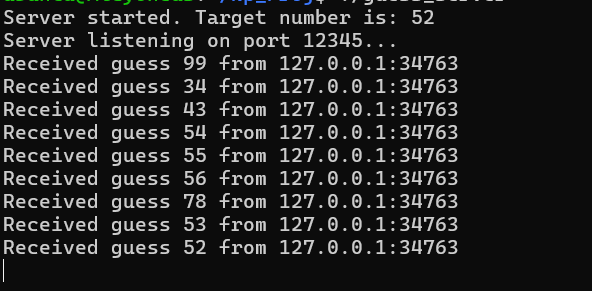
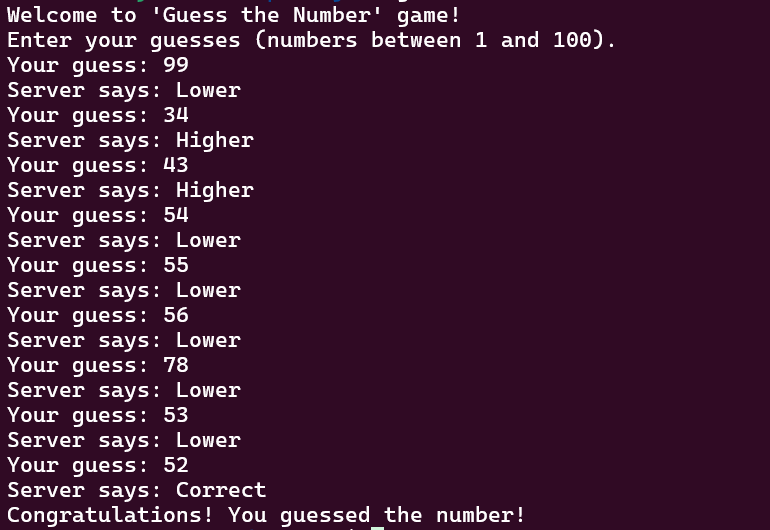

# UDP-Based "Guess the Number" Game 

##  Project Overview

This is a simple LAN-based multiplayer **"Guess the Number"** game implemented using **UDP sockets in C**. The server generates a random number, and clients try to guess it by sending guesses over the network. The server responds with hints ("Higher", "Lower", or "Correct") until the correct number is guessed.

---

##  Platform

- **Language:** C
- **Networking:** BSD Sockets (UDP)
- **Operating System:** Ubuntu Linux (via Windows Subsystem for Linux - WSL)
- **Compiler:** GCC

---

##  Project Structure

```
.
├── guess_server.c   # UDP server implementation
├── guess_client.c   # UDP client implementation
└── README.md        # Project documentation
```

---

##  Build Instructions

```bash
gcc guess_server.c -o guess_server
gcc guess_client.c -o guess_client
```

---

##    Run Instructions

###  Start the Server

```bash
./guess_server
```

###  Start the Client

```bash
./guess_client
```

---

##  Example Output

###  Server Terminal



###  Client Terminal



> These screenshots show the interaction where the client makes several guesses, and the server provides appropriate hints until the correct number (52) is guessed.

---

##  Networking Notes

- Communicates over **UDP on port 12345**
- Defaults to `127.0.0.1` (localhost). Change `SERVER_IP` in `guess_client.c` to connect across machines on the same LAN.

---

##  Features

- Random number generation
- Terminal-based client-server interaction
- Sequential handling of multiple clients

---

##  Troubleshooting

- Ensure the server is running before the client
- If testing on LAN, allow UDP on port 12345
- Check for typos or firewall blocking


